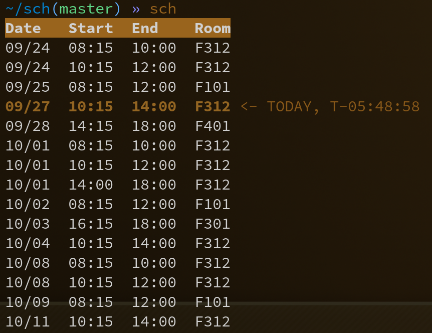

# Westerdals schedule CLI

If you happen to attend Westerdals, then you can use this script to check when you have classes.

## Dependencies

| Thing                                  | Required |
|----------------------------------------|----------|
| zsh                                    | yes      |
| jq                                     | yes      |
| [ansi](https://github.com/fidian/ansi) | no       |

## Configuration

Unless you are some kind of crazy stalker, you probably want to change the `url` variable at the very top of the script. This is where my script downloads its data, which is MY classes by default. To get your own link, go to [timedit](https://cloud.timeedit.net/campuskristiania_test3/web/oslo/ri10Z327X55Z07Q5Z56g6130yo0Y6YQ3p03gQY5Q5539Q0.html) and press the "Abonnér" button.

You might also want to change `upd_freq`, which is how often in seconds to update the data. The default is one hour.
